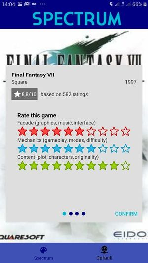
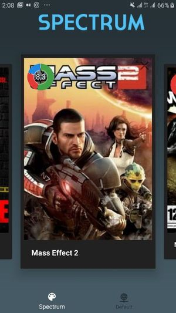

# SpectrumEvo

**SpectrumEvo** is the enhanced database for videogames. It suggests you fundamentally new system of rating based on rating components and criteria. For the first time you can only test this system by yourself, but in possible future you will be able to get average criteria weights from all users and share your favorites.

The application uses API: https://api.igdb.com/

The idea of rating system belongs to: http://gamesisart.ru/

## Screenshots

List of games

 

Default details

  

Pages with games

  

Spectrum rating

  

Spectrum web

  

## Technologies

1. Android SDK
2. Kotlin
3. Material Design Components
4. Retrofit
5. Android Architecture Components:
* Lifecycle
* Room
* LiveData
* Paging Library
6. Glide
7. Koin
8. Testing Components:
* Spek
* MockK

## Author

Valentine Litvin
